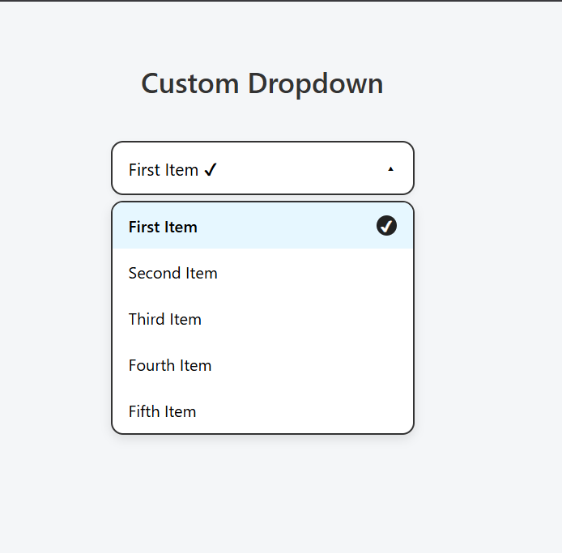

# Custom Dropdown

This is a modern custom dropdown component built using HTML, CSS, and JavaScript.

## 📌 Features
- Placeholder when no item is selected
- Opens to show all options
- Highlights the selected item
- Checkmark on the right in a dark-filled circle

## 📷 Preview

---

### 🛠️ Tech Used
- HTML5
- CSS3
- JavaScript (Vanilla)

https://mishalvs.github.io/Custom-Dropdown/

https://roadmap.sh/projects/custom-dropdown
